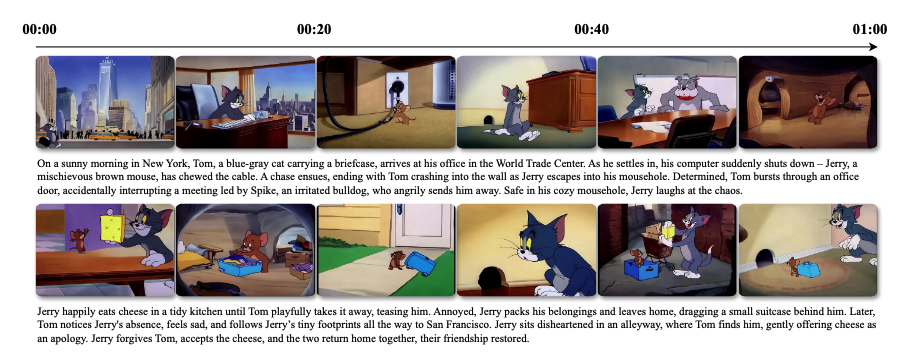
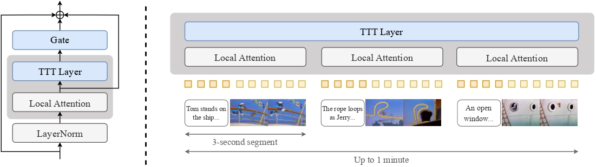

# TTT-Video

TTT-Video is a repository for finetuning diffusion transformers for style transfer and context extension. We use Test-Time Training (TTT) layers to handle long-range relationships across the global context, while reusing the original pretrained model's attention layers for local attention on each three second segment.  <br> <br>
In this repository, we include training and inference code for 63 second video generation. We finetune our model first at the original pretrained 3 second video length for style transfer and incorporating TTT layers. Then, we train in stages at video lengths of 9 sec, 18 sec, 30 sec, and 63 sec for context extension.

## Model Architecture


Our architecture adapts the [CogVideoX](https://github.com/THUDM/CogVideo) 5B model, a diffusion transformer for text-to-video generation, by incorporating TTT layers. The original pretrained attention layers are retained for local attention on each 3-second segment and its corresponding text. In addition, TTT layers are inserted to process the global sequence as well as its reversed version, with their outputs gated through a residual connection.

To extend context beyond the pretrained 3-second segments, each segment is interleaved with text and video embeddings.

For a more detailed explanation of our architecture, please refer to our [paper](https://test-time-training.github.io/video-dit/assets/ttt_cvpr_2025.pdf).


## Setup

### Dependencies
You can install dependencies needed for this project with conda (recommended) or a virtual environment.

#### Conda
```bash
conda env create -f environment.yaml
conda activate ttt-video
```

#### Pip
```bash
pip install -e .
```

### Kernel Installation
After installing the dependencies, you must install the TTT-MLP kernel.

```bash
git submodule update --init --recursive
(cd ttt-tk && python setup.py install)
```

> **Note**: You must have cuda toolkit (12.3+) and gcc11+ installed to build the TTT-MLP kernel. We only support training on H100s for TTT-MLP. You can install cuda toolkit [here](https://anaconda.org/nvidia/cuda-toolkit).

### CogVideoX Pretrained Model
Please follow the instructions [here](https://github.com/THUDM/CogVideo/blob/main/sat/README.md) to get the VAE and T5 encoder. To get the pretrained weights, download the `diffusion_pytorch_model-00001-of-00002.safetensors` and `diffusion_pytorch_model-00002-of-00002.safetensors` files from [HuggingFace](https://huggingface.co/THUDM/CogVideoX-5b/tree/main/transformer).

> **Note**: We only use the 5B weights, not the 2B weights. Make sure you are downloading the correct model.

> **Note**: These are the pretrained model weights, not the final model weights used to generate our demonstration videos.

## Annotation Download
Text annotations for the 3-second Tom and Jerry segments used during training can be accessed [here](https://test-time-training.github.io/video-dit/assets/annotations.zip).

## Other Documentation
- [Dataset](./docs/dataset.md)
- [Training](./docs/training.md)
- [Sampling](./docs/sampling.md)
